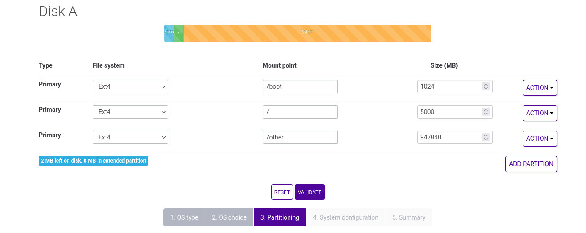

<!-- -*- mode:markdown;tab-width:2;indent-tabs-mode:nil;coding:utf-8 -*-
     vim: ft=markdown syn=markdown fileencoding=utf-8 sw=2 ts=2 ai eol et si
     README.md: Scaleway Fully Encrypted Debian installation

     This program is free software. It comes without any warranty, to
     the extent permitted by applicable law. You can redistribute it
     and/or modify it under the terms of the Do What The Fuck You Want
     To Public License, Version 2, as published by Sam Hocevar. See
     http://www.wtfpl.net/ for more details.
  -->

# Scaleway Fully Encrypted Debian Install

## TL;DR

1. Do a normal Debian server install but use future swap partition as root filesystem and prepare future root space
2. After the first boot crypt future root partition and install some packages
3. Use the rescue system to install new root filesystem on crypted target.
4. Do some stuff to get all workging after next reboot.
5. Reboot and log in with `ssh` while in boot process (`initramfs`+`dropbear`).
6. Decrypt all then log out.
7. Enjoy your fully encrypted Debian system.

## Final objectives

All partition but _/boot_ will be encrypted. Current partition layout is
based on disk space available for a Scaleway Start-2-S-SATA 2022, i.e. 1xTo HD.

| Type     | Initial mount point | Size      | After install | encrypted |
|:---------|:--------------------|----------:|:--------------|-----------|
| Primary  | /boot (Ext4)        |      1 Go | /boot (Ext4)  | no        |
| Primary  | _Swap_              |      5 Go | swap          | **yes**   |
| Primary  | /     (Ext4)        |    925 Go | / (Ext4)      | **yes**   |

## Scaleway.com classical install


### Server OS type


### Initial partitioning screenshot




Then, finish the install as usual


## Prepare encryption


### Step1: prepare the setup from the server itself ###


```console
root@scalewaysrv:~# lsblk -o +UUID
NAME   MAJ:MIN RM   SIZE RO TYPE MOUNTPOINT UUID
sda      8:0    0 931.5G  0 disk            
├─sda1   8:1    0     1G  0 part /boot      52f74c0a-aae0-416c-ad4a-9d6b02715873
├─sda2   8:2    0     5G  0 part /          35804dda-01a4-4f69-a757-008035e685e1
└─sda3   8:3    0 925.5G  0 part /other     0a57f63f-ed3c-4dce-b8b3-f168819c6ee3
```


```console
$ apt-get update
$ apt-get upgrade
$ apt-get install unattended-upgrades apt-listchanges git screen vim net-tools python3 python3-virtualenv iftop postfix mailutils nftables ufw wireguard cryptsetup dropbear-initramfs tcpdump ansible rsync linux-image-amd64 grub-pc busybox kbd uuid-runtime

# Setup sda3 as crypted newroot
root@scalewaysrv:~# umount /other
root@scalewaysrv:~# rmdir /other
root@scalewaysrv:~# vim /etc/fstab  # remove /other line
# https://access.redhat.com/solutions/230993
root@scalewaysrv:~# dd if=/dev/random bs=32 count=1 of=/root/random_data_keyfile1
root@scalewaysrv:~# # Make sure to make a copy of /root/random_data_keyfile1
root@scalewaysrv:~# export NEWROOTLUKSUUID=$(uuidgen)
root@scalewaysrv:~# cryptsetup --key-file /root/random_data_keyfile1 --uuid $NEWROOTLUKSUUID luksFormat /dev/sda3 
root@scalewaysrv:~# lsblk -o +UUID
NAME   MAJ:MIN RM   SIZE RO TYPE MOUNTPOINT UUID
sda      8:0    0 931.5G  0 disk            
├─sda1   8:1    0     1G  0 part /boot      52f74c0a-aae0-416c-ad4a-9d6b02715873
├─sda2   8:2    0     5G  0 part /          35804dda-01a4-4f69-a757-008035e685e1
└─sda3   8:3    0 925.5G  0 part            e304c764-78b9-44ad-9d91-a0cc666c42bd
root@scalewaysrv:~# cryptdisks_start newroot
Starting crypto disk...newroot (starting)...newroot (started)...done.
root@scalewaysrv:~# mkfs.ext4 /dev/mapper/newroot 

root@scalewaysrv:~# lsblk -o +UUID
NAME        MAJ:MIN RM   SIZE RO TYPE  MOUNTPOINT UUID
sda           8:0    0 931.5G  0 disk             
├─sda1        8:1    0     1G  0 part  /boot      52f74c0a-aae0-416c-ad4a-9d6b02715873
├─sda2        8:2    0     5G  0 part  /          35804dda-01a4-4f69-a757-008035e685e1
└─sda3        8:3    0 925.5G  0 part             e304c764-78b9-44ad-9d91-a0cc666c42bd
  └─newroot 254:0    0 925.5G  0 crypt            6225601a-2cd4-4142-bf81-9945f0231e6d

```

### Step2: Finish the setup from the rescue ubuntu ###

```console
root@51-15-180-13:~# lsblk -o +UUID
NAME   MAJ:MIN RM   SIZE RO TYPE MOUNTPOINT                                      UUID
loop0    7:0    0 602,9M  1 loop /usr/lib/live/mount/rootfs/img.current.squashfs 
sda      8:0    0 931,5G  0 disk                                                 
├─sda1   8:1    0     1G  0 part                                                 52f74c0a-aae0-416c-ad4a-9d6b02715873
├─sda2   8:2    0     5G  0 part                                                 35804dda-01a4-4f69-a757-008035e685e1
└─sda3   8:3    0 925,5G  0 part                                                 e304c764-78b9-44ad-9d91-a0cc666c42bd

root@51-15-180-13:~# apt-get install cryptsetup
root@51-15-180-13:~# mkdir /mnt/newroot
root@51-15-180-13:~# mkdir /mnt/oldroot
root@51-15-180-13:~# mkdir /mnt/boot
root@51-15-180-13:~# mount /dev/sda1 /mnt/boot
root@51-15-180-13:~# mount /dev/sda2 /mnt/oldroot
root@51-15-180-13:~# cryptsetup --key-file /mnt/oldroot/root/random_data_keyfile1 luksOpen /dev/sda3 newroot
root@51-15-180-13:~# mount /dev/mapper/newroot /mnt/newroot
root@51-15-180-13:~# rsync -av /mnt/oldroot/ /mnt/newroot/
root@51-15-180-13:~# touch /mnt/newroot/NEWROOT

root@51-15-180-13:~# mount -o bind /sys /mnt/newroot/sys
root@51-15-180-13:~# mount -o bind /proc /mnt/newroot/proc
root@51-15-180-13:~# mount -o bind /dev /mnt/newroot/dev
root@51-15-180-13:~# mount -o bind /dev/pts /mnt/newroot/dev/pts
root@51-15-180-13:~# mount -o bind /run /mnt/newroot/run
root@51-15-180-13:~# mount -o bind /run/lock /mnt/newroot/run/lock
root@51-15-180-13:~# mount -o bind /run/shm /mnt/newroot/run/shm
root@51-15-180-13:~# mount -o bind /mnt/boot /mnt/newroot/boot

root@51-15-180-13:~# chroot /mnt/newroot /bin/bash
root@51-15-180-13:/# export debian_chroot=debian_chroot
(debian_chroot)root@51-15-180-13:/# alias ll='ls -alF'
(debian_chroot)root@51-15-180-13:/# ll
total 68
drwxr-xr-x  18 root root  4096 Nov 23 23:32 ./
drwxr-xr-x  18 root root  4096 Nov 23 23:32 ../
-rw-r--r--   1 root root     0 Nov 23 23:32 NEWROOT
...
(debian_chroot)root@51-15-180-13:/# lsblk -o +UUID
NAME        MAJ:MIN RM   SIZE RO TYPE  MOUNTPOINT UUID
loop0         7:0    0 602.8M  1 loop             
sda           8:0    0 931.5G  0 disk             
|-sda1        8:1    0     1G  0 part  /boot      52f74c0a-aae0-416c-ad4a-9d6b02715873
|-sda2        8:2    0     5G  0 part             35804dda-01a4-4f69-a757-008035e685e1
`-sda3        8:3    0 925.5G  0 part             e304c764-78b9-44ad-9d91-a0cc666c42bd
  `-newroot 253:0    0 925.5G  0 crypt /          6225601a-2cd4-4142-bf81-9945f0231e6d
(debian_chroot)root@51-15-180-13:/# echo $NEWROOTLUKSUUID 
e304c764-78b9-44ad-9d91-a0cc666c42bd
(debian_chroot)root@51-15-180-13:/# ## NEW /etc/crypttab
(debian_chroot)root@51-15-180-13:/# cat >| /etc/crypttab << EOF
# <target name> <source device>         <key file>      <options>
newroot UUID=$NEWROOTLUKSUUID none luks,initramfs
EOF
(debian_chroot)root@51-15-180-13:/# cat /etc/crypttab 
# <target name> <source device>         <key file>      <options>
newroot UUID=e304c764-78b9-44ad-9d91-a0cc666c42bd none luks,initramfs
(debian_chroot)root@51-15-180-13:/# ## NEW /etc/fstab
## UUID=35804dda-01a4-4f69-a757-008035e685e1 /               ext4    noatime,errors=remount-ro 0       1
## by
## /dev/mapper/newroot / ext4 noatime 0 2
(debian_chroot)root@51-15-180-13:/# sed -i 's|^UUID=.*/\s.*|/dev/mapper/newroot / ext4 noatime 0 2|g' /etc/fstab
(debian_chroot)root@51-15-180-13:/# cat /etc/fstab
# /etc/fstab: static file system information.
#
# Use 'blkid' to print the universally unique identifier for a
# device; this may be used with UUID= as a more robust way to name devices
# that works even if disks are added and removed. See fstab(5).
#
# systemd generates mount units based on this file, see systemd.mount(5).
# Please run 'systemctl daemon-reload' after making changes here.
#
# <file system> <mount point>   <type>  <options>       <dump>  <pass>
# / was on /dev/sda2 during installation
/dev/mapper/newroot / ext4 noatime 0 2
# /boot was on /dev/sda1 during installation
UUID=52f74c0a-aae0-416c-ad4a-9d6b02715873 /boot           ext4    noatime         0       2
(debian_chroot)root@51-15-180-13:/# ## no more references to 008035e685e1 in /etc:
(debian_chroot)root@51-15-180-13:/# grep -r 008035e685e1 /etc
(debian_chroot)root@51-15-180-13:/# 
(debian_chroot)root@51-15-180-13:/# cd /etc/dropbear-initramfs/
(debian_chroot)root@51-15-180-13:/etc/dropbear-initramfs# cp /root/.ssh/authorized_keys /etc/dropbear-initramfs/
(debian_chroot)root@51-15-180-13:/etc/dropbear-initramfs# chmod 400 /etc/dropbear-initramfs/authorized_keys 
(debian_chroot)root@51-15-180-13:/etc/dropbear-initramfs# echo 'DROPBEAR_OPTIONS="-p 5678 -s -j -k -I 60"'  >> /etc/dropbear-initramfs/config 
(debian_chroot)root@51-15-180-13:/etc/dropbear-initramfs# grep -v "^#" /etc/dropbear-initramfs/config
DROPBEAR_OPTIONS="-p 5678 -s -j -k -I 60"
(debian_chroot)root@51-15-180-13:/etc/dropbear-initramfs# ll
total 28
drwxr-xr-x  2 root root 4096 Nov 24 00:15 ./
drwxr-xr-x 82 root root 4096 Nov 24 00:06 ../
-r--------  1 root root  725 Nov 24 00:15 authorized_keys
-rw-r--r--  1 root root 1234 Nov 24 00:17 config
-rw-------  1 root root  141 Nov 23 22:02 dropbear_ecdsa_host_key
-rw-------  1 root root   83 Nov 23 22:02 dropbear_ed25519_host_key
-rw-------  1 root root  804 Nov 23 22:02 dropbear_rsa_host_key
(debian_chroot)root@51-15-180-13:/etc/dropbear-initramfs# cd

(debian_chroot)root@51-15-180-13:/# ## All ready for grub:
(debian_chroot)root@51-15-180-13:/# ## remove oldroot to make sure that grub will not attempt to use it:
(debian_chroot)root@51-15-180-13:~# exit
root@51-15-180-13:~# shred -n 10 -z -u /mnt/oldroot/root/random_data_keyfile1 
root@51-15-180-13:~# shred -n 10 -u -z /mnt/newroot/random_data_keyfile1 

root@51-15-180-13:~# umount /mnt/oldroot
root@51-15-180-13:~# mkfs.ext4 /dev/sda2
root@51-15-180-13:~# chroot /mnt/newroot /bin/bash
root@51-15-180-13:/# export debian_chroot=debian_chroot

(debian_chroot)root@51-15-180-13:~# update-initramfs -u -k all
(debian_chroot)root@51-15-180-13:~# grub-install --boot-directory=/boot /dev/sda
Installing for i386-pc platform.
Installation finished. No error reported.
(debian_chroot)root@51-15-180-13:~# update-initramfs -u -k all
(debian_chroot)root@51-15-180-13:~# update-grub

(debian_chroot)root@51-15-180-13:/# ## no more references to 008035e685e1 in /boot/grub/grub.cfg, but some for 6225601a-2cd4-4142-bf81-9945f0231e6d
(debian_chroot)root@51-15-180-13:/# grep -r 008035e685e1 /boot
(debian_chroot)root@51-15-180-13:/# grep -r 6225601a-2cd4-4142-bf81-9945f0231e6d /boot
[...]

(debian_chroot)root@51-15-180-13:/# exit
root@51-15-180-13:~# umount /mnt/newroot/boot
root@51-15-180-13:~# umount /mnt/newroot/run/lock
root@51-15-180-13:~# umount /mnt/newroot/run
root@51-15-180-13:~# umount /mnt/newroot/proc
root@51-15-180-13:~# umount /mnt/newroot/sys
root@51-15-180-13:~# umount /mnt/newroot/dev/pts
root@51-15-180-13:~# umount /mnt/newroot/dev
root@51-15-180-13:~# umount /mnt/newroot
root@51-15-180-13:~# umount /mnt/boot/
root@51-15-180-13:~# cryptsetup close newroot
root@51-15-180-13:~# /sbin/shutdown -r now

BOOT IN NORMAL MODE NOW FROM THE UBUNTU CONSOLE
```


### Step 3: reboot and unlock root via ssh ###

If all works as expected, the server should be running its initramfs dropbear ssh server on port 5678

```console
gpg --decrypt luks_key_scalewaysrv.gpg|ssh -p 5678 root@51.15.180.13 "cat - > /lib/cryptsetup/passfifo"
```

If all works, you should now access the full-disk encrypted (except swap) debian server.


### Step 4: Setup crypted swap on /dev/sda2 from server ###

```console
# Clear /dev/sda2 before using it as swap
root@scalewaysrv:~# dd if=/dev/zero of=/dev/sda2 bs=10M
dd: error writing '/dev/sda2': No space left on device
513+0 records in
512+0 records out
5368709120 bytes (5.4 GB, 5.0 GiB) copied, 45.424 s, 118 MB/s


# To use a by-id persistent device naming in crypttab instead of kernel simple naming, identify the swap device
root@scalewaysrv:~# find -L /dev/disk -samefile /dev/sda2|grep by-id|tail -n 1
/dev/disk/by-id/ata-HGST_HTS721010A9E630_JR1000D33ZB25E-part2
root@scalewaysrv:~# SWAPPARTITION=$(find -L /dev/disk -samefile /dev/sda2|grep by-id|tail -n 1)
# https://wiki.archlinux.org/title/Dm-crypt/Swap_encryption
root@scalewaysrv:~# echo "encrypted_swap ${SWAPPARTITION} /dev/urandom swap,plain,cipher=aes-cbc-essiv:sha256,size=256" >> /etc/crypttab 
root@scalewaysrv:~# cat /etc/crypttab
root@scalewaysrv:~# cryptdisks_start encrypted_swap
Starting crypto disk...encrypted_swap (starting)...encrypted_swap (started)...done.
root@scalewaysrv:~# echo "/dev/mapper/encrypted_swap none swap defaults 0 0" >> /etc/fstab
root@scalewaysrv:~# cat /etc/fstab 
# /etc/fstab: static file system information.
#
# Use 'blkid' to print the universally unique identifier for a
# device; this may be used with UUID= as a more robust way to name devices
# that works even if disks are added and removed. See fstab(5).
#
# systemd generates mount units based on this file, see systemd.mount(5).
# Please run 'systemctl daemon-reload' after making changes here.
#
# <file system> <mount point>   <type>  <options>       <dump>  <pass>
# / was on /dev/sda2 during installation
/dev/mapper/newroot / ext4 noatime 0 2
# /boot was on /dev/sda1 during installation
UUID=52f74c0a-aae0-416c-ad4a-9d6b02715873 /boot           ext4    noatime         0       2
/dev/mapper/encrypted_swap none swap defaults 0 0
root@scalewaysrv:~# swapon -a
root@scalewaysrv:~# swapon --show
NAME      TYPE      SIZE USED PRIO
/dev/dm-1 partition   5G   0B   -2


```

# Done !


### Credits ###

 * https://github.com/Val/dedibox_fully_encrypted_debian_install
 * https://iotechonline.com/luks-encryption-enable-remote-ssh-unlocking/


